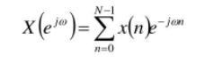
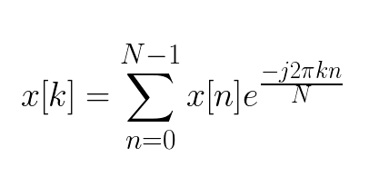

## Proposal

* Project Title: Serial and Parallel: Different Problems in Different Languages 
* Team: Leonardo Ferrisi and Talha Mushtaq

## Project Description

*The goal of this project is to apply serial and parallel implementations of the following two algorithms:*

1. **Prim's Algorithm: It is a greedy algorithm that is used to find the Minimum Spanning Tree (MST) from a graph. Prim's algorithm finds the subset of edges that includes every vertex of the graph such that the sum of the weights of the edges can be minimized.** 

      Prim's algorithm can be used in real life; an example is a cable company wanting to lay line to multiple neighborhoods; by minimizing the amount of cable laid, the cable company will save money. A tree has one path joins any two vertices. A spanning tree of a graph is a tree that: Contains all the original graph's vertices.

      The algorithm is currently being taught in my CSC-250, Algorithm Design, class and I am motivated to fully write the serial implementation of the algorithm in C. The serial implementation would allow me to better understand the algorithm in a fully implemented manner and writing the code in C will further increase my practice in the language. The parallel version of the implementation will allow me and my team member to experiment parallelizing this MST algorithm using openMP and see if there are any speedups. 

2. **A Discrete Fourier Transform (DFT) algorithm: In mathematics, the discrete Fourier transform converts a finite sequence of equally-spaced samples of a function into a same-length sequence of equally-spaced samples of the discrete-time Fourier transform, which is a complex-valued function of frequency. DFT has become the core of many digital signal processing systems. These systems can perform general time domain signal processing and classical frequency domain processing.**

      *The bonus part for additional understanding (getting the extra grip) of the material will consist of python implementation of the MPI projects we did in the class*

      The most challenging part of this project would be the background research on the algorithms/concepts and understanding before implementing the serial versions of the algorithms. The second most challenging part could be evaluating what part of the problem should we parallelize. As for using python implementation of the DFT algorithm and the bonus part, we would have to research MPI and openMP documentations and syntax conversions from C to Python for parallelizing.

<!-- What computational problem/challenge are you trying to solve?  Why does this interest you?

Why parallelize this particular problem?

What do you expect to be the most challenging part of the project?
-->

## Planning

### Class Assignments in Python

Using **mpi4py**, we intend to re-implement some of the classes previous MPI assignments in python if anything, to get a feel for mpi programming in python for our specific applications such as Parallel DFT.

## **Prim's Algorithm** 

For Prim's algorithm; parallelizing the main loop of Prim's algorithm is difficult [1], since after adding a vertex to MST lightest edges incident on MST change. Only two steps can be parallelized: selection of the minimum-weight edge connecting a vertex not in MST to a vertex in MST, and updating array d after a vertex is added to MST.

Prim's technique works on the simple premise that all vertices in a spanning tree must be connected. To build a Spanning Tree, the two distinct subsets of vertices (explained above) must be joined. To make it a Minimum Spanning Tree, they must be connected with the minimum weight edge. 

The serial implementation will have the following steps:

1) Make an MST set that keeps track of the vertices that are already in MST.

2) All vertices in the input graph should be given a key value. All key values should be set to INFINITE. Assign the first vertex a key value of 0 to ensure that it is chosen first.

3) While MST set doesn’t include all vertices

   a) Pick a vertex u which is not there in mstSet and has minimum key value.

   b) Include u to MST set.

   c) Update key value of all adjacent vertices of u. To update the key values, iterate through all adjacent vertices. For every adjacent vertex v, if weight of edge   u-v is less than the previous key value of v, update the key value as weight of u-v. 

The parallel implementation parallelizes the vertices in finding the local minimums and local indexes. However, critical statement is used when getting the global minimum and global index [4].  

## **Discrete Fourier Transform**

The Discrete Fourier Transform (DFT) is a fundamental component of the world of signal processing. The DFT however takes, takes an execisive amount of time with an increasing size of N where N refers to the number of samples in a signal. The Fast Fourier Transform (FFT) solves this issue to an extent enabling speedier computations provided the assumption that N is a multiple of 2, which allows symmetries to occur in the Fourier Transform anyways which enables the algorithm to reduce the number of calculations needed. [5]

### *The Discrete Fourier Transform*

The rationale for parallelizing the DFT is to see whether or not speedups occur that are in any way comporable to a serial FFT.

### *The Fast Fourier Transform*

I plan to parallelize this algorithm by dividing the signal being processed into *n* chunks where *n* refers to the number of processes, and conduct a DFT on each of those chunks in parallel, then merge the resulting DFTs into a single signal.

*The ParallelDFT attempt will be done using mpi4py because error handling is a little more intutive and plotting the results is easier tho in theory all of this is implementable in C*

The serial implementation has the following steps:

- Get the samplingRate, length of signal as N
- creater an array of N items, create a reshaped array of shape (N, 1)
- Calculate the exponential of (-2i * pi * ((0,1,...,N), 1) * ( (0, 1, ..., N) / N ) )
- Generate DFT: Get the dot product of e^(-2i * pi * ((0,1,...,N), 1) * ( (0, 1, ..., N) / N ) and the input signal
- Get the length of our DFt
- Create an array of N items numbered 0 - N
- Divide the signal by sampling rate to get time scale
- Get the frequency by dividing everything in array by Time
- The Nyquist Freq is equal to half of the signal length
- Get only oneside of the frequency domain, since it is mirrored
- Normalize amplitudes

<!--
How do you plan to solve the problem serially?  For instance, will any special data structures be needed?

When do you expect do be done with serialization? (See Hofstadter's Law).

How do you plan on parallelizing it?

take a look at Foster's Design Methodology (discussed in class, and in the Quinn reading), but you don't (yet) have to adopt the language of the Methodology.

When do you expect to be done with parallelization? ((See Hofstadter's Law).

How many Walltime-CPU-Hours of run-time do you anticipate needing to generate results? 

Working backwards, how many days before the due date do you need to have working parallel code?

How long will it take you to analyze your results and write your report?
-->

## Logistics
<!--
Are you using an external tools/libraries?
-->

No, I am not using any libraries. I would be using openmp for parallelizing. 
I will be using omp for nowait, as I would not need syncronization of loops at a certain point. 

For parallelizing the Discrete Fourier Transform as with the re-implementation of class assignments in python, both will reply on using the mpi4py package allowing for distributed memory programming using Python.

## Testing:

<!-- 

how will you verify that serial solutions are correct?

how will you verify that parallel solutions are correct?
-->

Running print statement and checking for speedups. There are several references, which allows for a string hypothesis and expectation. 
Speedups will be compared with those hypothesis. I have reported speedups in the next section

## Conclusion and Analysis:
<!--
What speedups and efficiencies, roughly, do you anticipate? 
-->

### Prim's Algorithm

#### Serial

| 10         | 100       | 1000     | 10000     |    
|:----:      | :---:     | :---:    |  :---:    |      
| 0.000004   | 0.000087  | 0.005755 | 0.537259  |     

#### Parallel 

|       |    10    | 100        |  1000    |  10000    
| :---  |:----:    | :---:      | :---:    |  :---:         
| 1     | 0.000171 | 0.000319   | 0.007980 | 0.595332          
| 2     | 0.000220 | 0.000310   | 0.006051 | 0.353818         
| 4     | 0.000296 | 0.000892   | 0.005203 | 0.270297          
| 8     | 0.001112 | 0.001977   | 0.004840 | 0.196776

#### **Analysis**:

The serial implementation of Prim's algorithm the increase in runtimes (measured in seconds) with the increase in the number of vertices (from 10 vertices to 10000). 

The parallel implementation of Prim's algorithm shows clear speedups when we have sufficiently large number of vertices (starting with 1000). As the number of threads increases, the elapsed time decreases (From 0.007 to 0.004 when the number of vertices is 1000). Greater speedups were achieved when the number of vertices were 10000. 

### DFT

| Sample Rate | Duration | Time   | Condition |
|-------------|----------|--------|-----------|
|      64     |    32    |190.0 ms|  serial dft  |
|      64     |    32    |5.94 ms|  fft   |
|      64     |    32    |310.0 ms|  parallel dft (2 proc)   |
|      64     |    32    |396.91 ms|  parallel dft (4 proc)   |

#### **Analysis**:

The rationale for parallelizing the DFT was to observe if it is at all faster than the FFT on a given signal of same sampling rate and duration. 

Through testing this theory was found to be incorrect. The parallel DFTs took twice as long as the serial DFT on the same signal and nearly 52 times slower than the FFT.

There are a number of reasons that this could be occuring. The primary reason is likely that the using MPI in python has some shortcomings in reference to MPI typically used with C. There is also a reason signal processing just uses the FFT instead of parallelizing a DFT. The algorithm works faster and at least for the uniform noisy sinewaves generated - signal loss is non-existent

## Assessment (Teams only)

<!--
how do you propose to divide the labor?
how do you propose to divide the grade?
-->

- Talha: Primary focus on Prim's algorithm

- Leo: Primary focus on DFT

- Combined (Leo and Talha): Python implementation of some class projects (MPI) in C 

The aim of this teamwork is to expand on the concepts and learn from each other's individual's interest, strengthening the concepts taught by John in CSC 333. 
The diversity of the sub-projects (Prim's, DFT, and Python implementation of MPI) will provide an opportunity to hammer down the concepts and learn how to parallelize code in different situations/algorithms. 

The amount of work we put into this is immense, but we learned a lot out of the projects. 
We hope to get an extra proficiency or two :p

## Score Sheet

| Item                    |     Expected Deadline| Achieved Date   |
|-------------------------|-------------------:|-----------------|
| Serial Implementation    |   6/4                |      6/2           |
| Parallel Implementation |     6/5               |      6/5           |
| Correctness             | 6/6|   6/6                |                 |
| Writeup/Analysis        | 6/6  |    6/6                |               |
| Wattage                 | |       -            |     -            |

Utility:

   - DFT Parallel: The DFT is a fundamental algorithm to signal processing. Conceptutally it is not that difficult and the novelty of coding it out instead of importing a package to conduct it is an excellent way of demonstrating complex equations in python / c and furthermore how they might benefit from parallelization.

## References 
[1] Lončar, Vladimir, Srdjan Škrbić, and Antun Balaž. "Parallelization of minimum spanning tree algorithms using distributed memory architectures." Transactions on Engineering Technologies. Springer, Dordrecht, 2014. 543-554.

[2] https://ppc.cs.aalto.fi/ch3/nowait/

[3] Bentley, Jon Louis. "A parallel algorithm for constructing minimum spanning trees." Journal of algorithms 1.1 (1980): 51-59.

[4] Parth Rupala. "Parallel Implementation of Prim's Algorithm Using OpenMP." Department of Electrical Engineering and Computer Science. University of California, Irvine. 

[5] Sevgi, Levent. "Numerical Fourier transforms: DFT and FFT." IEEE Antennas and Propagation Magazine 49.3 (2007): 238-243.

[6] https://mpi4py.readthedocs.io/en/stable/index.html